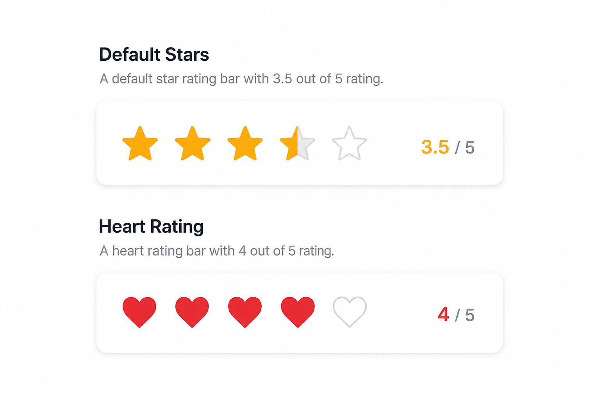
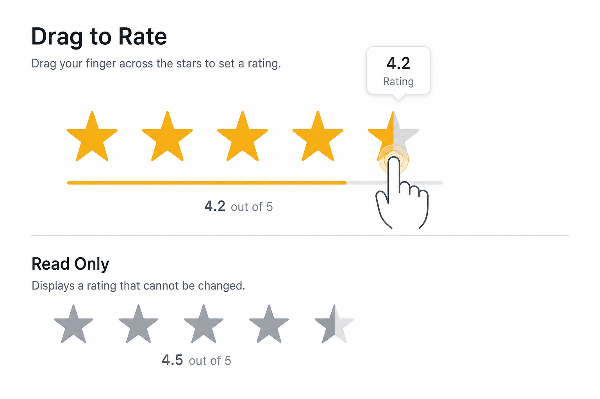
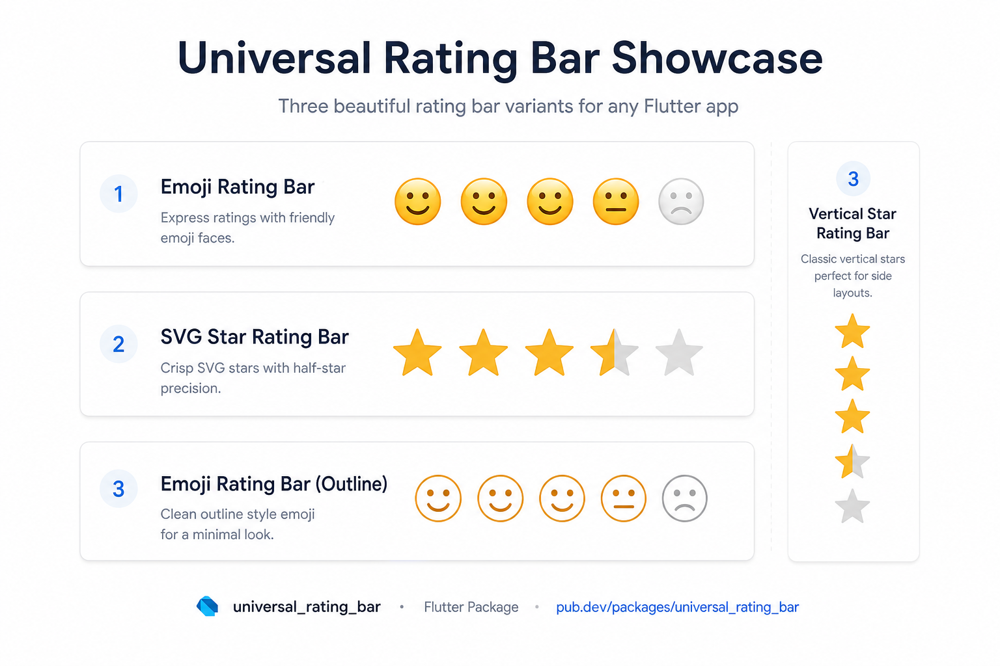

# flutter_rating_bar_universal

[](https://pub.dev/packages/flutter_rating_bar_universal)
[](LICENSE)

A flexible, production-ready Flutter rating bar that supports **icons**, **SVG/PNG assets**, and **custom widgets** — with half ratings, drag gestures, animations, and read-only display mode.

Most rating packages only accept `IconData`. This package solves that with three rendering modes and a unified API.

<p align="center">
  
</p>

## Why this package?

| Problem in other packages | flutter_rating_bar_universal |
|---|---|
| Only `IconData` | Icon, SVG/PNG, network, custom widgets |
| Poor half-star rendering | `Icons.star_half` + dynamic clip |
| No read-only mode | `isInteractive: false` |
| No drag support | `updateOnDrag: true` |
| No fractional precision | `precision: 0.1` → `3.7` ratings |
| Hard to theme | `itemBuilder` + per-state colors |

## Features

- **3 rendering modes** — Icon, Asset (SVG/PNG/network), Widget
- **Built-in half-star icon** — auto uses `Icons.star_half` for default stars
- **Half & fractional ratings** — `3.5`, `3.7`, any precision
- **Custom clipping** — automatic half-star clip or dedicated half asset/widget
- **Read-only mode** — `isInteractive: false` or `ignoreGestures: true`
- **Drag rating** — `updateOnDrag: true`
- **Animations** — smooth rating transitions and optional scale effect
- **Vertical layout** — `direction: Axis.vertical`
- **itemBuilder** — full per-item control via `RatingState`
- **Zero-config defaults** — works out of the box with star icons

## Screenshots

<p align="center">
  
</p>

<p align="center">
  
</p>

> Run the example app locally for live interaction:
> `cd example && flutter run`

## Installation

```yaml
dependencies:
  flutter_rating_bar_universal: ^1.0.0
```

## Quick Start

```dart
import 'package:flutter_rating_bar_universal/flutter_rating_bar_universal.dart';
```

### Default stars (with auto half-star icon)

```dart
UniversalRatingBar(
  rating: 3.5,
  onRatingChanged: (value) => print(value),
)
```

At `3.5`, the bar automatically renders `Icons.star_half` — no extra setup needed.

### Custom icons

```dart
UniversalRatingBar.icon(
  rating: 4,
  filledIcon: Icons.favorite,
  emptyIcon: Icons.favorite_border,
  filledColor: Colors.red,
  emptyColor: Colors.grey,
  onRatingChanged: (value) => setState(() => rating = value),
)
```

### SVG / PNG assets

```dart
UniversalRatingBar.asset(
  rating: 3.5,
  filledAsset: 'assets/icons/star_filled.svg',
  emptyAsset: 'assets/icons/star_empty.svg',
  halfAsset: 'assets/icons/star_half.svg', // optional
  onRatingChanged: (value) => setState(() => rating = value),
)
```

Network URLs are also supported:

```dart
UniversalRatingBar.asset(
  rating: 4,
  filledAsset: 'https://example.com/star_full.png',
  emptyAsset: 'https://example.com/star_empty.png',
)
```

### Custom widgets

```dart
UniversalRatingBar.custom(
  rating: 2.5,
  filledWidget: Text('😍', style: TextStyle(fontSize: 28)),
  emptyWidget: Text('😐', style: TextStyle(fontSize: 28)),
  onRatingChanged: (value) => setState(() => rating = value),
)
```

### itemBuilder (enterprise-grade customization)

```dart
UniversalRatingBar.custom(
  rating: 3.5,
  itemBuilder: (context, index, state) {
    switch (state) {
      case RatingState.full:
        return Icon(Icons.star, color: Colors.amber);
      case RatingState.half:
        return Icon(Icons.star_half, color: Colors.amber);
      case RatingState.empty:
        return Icon(Icons.star_border, color: Colors.grey);
    }
  },
  onRatingChanged: (value) => setState(() => rating = value),
)
```

## Configuration

| Property | Default | Description |
|---|---|---|
| `rating` | required | Current rating value |
| `itemCount` | `5` | Number of items |
| `size` | `32` | Item size |
| `spacing` | `2` | Gap between items |
| `allowHalfRating` | `true` | Enable half/fractional ratings |
| `precision` | `0.5` | Snap step (`0.1`, `0.25`, `0.5`) |
| `isInteractive` | `true` | `false` for display-only |
| `ignoreGestures` | `false` | Force-disable all gestures |
| `updateOnDrag` | `true` | Drag to set rating |
| `direction` | `Axis.horizontal` | Horizontal or vertical |
| `animateRatingChange` | `false` | Animate rating transitions |
| `animationDuration` | `300ms` | Animation duration |
| `enableScaleEffect` | `false` | Scale item on interaction |
| `halfClipFraction` | `0.5` | Default clip for half items |
| `halfIcon` | auto | Defaults to `Icons.star_half` for star icons |

## Half-star behavior

| Mode | Half rendering |
|---|---|
| **Icon (default stars)** | `Icons.star_half` automatically |
| **Icon (custom)** | Clips filled icon over empty icon |
| **Asset** | Uses `halfAsset` or dynamic `ClipRect` |
| **Widget** | Uses `halfWidget` or dynamic `ClipRect` |
| **itemBuilder** | You control all three states |

## Read-only mode

```dart
UniversalRatingBar(
  rating: 4.5,
  isInteractive: false,
)
```

## Drag rating

```dart
UniversalRatingBar(
  rating: rating,
  updateOnDrag: true,
  precision: 0.1,
  onRatingChanged: (value) => setState(() => rating = value),
)
```

## Vertical rating

```dart
UniversalRatingBar(
  rating: 3,
  direction: Axis.vertical,
)
```

## Animated rating

```dart
UniversalRatingBar(
  rating: rating,
  animateRatingChange: true,
  animationDuration: Duration(milliseconds: 300),
  enableScaleEffect: true,
  onRatingChanged: (value) => setState(() => rating = value),
)
```

## Alias

`FlexRatingBar` is exported as a typedef alias for `UniversalRatingBar`.

## Example app

```bash
git clone https://github.com/DroidMagician/Universal-Rating-Bar
cd Universal-Rating-Bar/example
flutter run
```

## pub.dev topics

`rating` · `rating-bar` · `star-rating` · `widgets` · `svg`

## License

MIT
